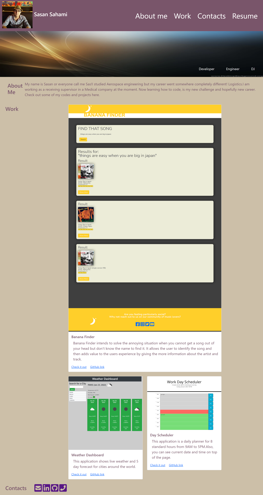

# portfolio
## Description
This is my first portfolio web page and included my projects and contact details. you can find my photo and a little bit of information about who I am.
## Usage
to create an easy-to-use steps in my page,I cearted an responsive way,so when you click on bottons on navigation bar, it sends you to the related section of the page.
Then when you click on the photos in WORK section, it sends you to the projects i have done so far.
This is a screenshot of my page:

you can access to my web page from following link:
https://sasansinson.github.io/portfolio/

